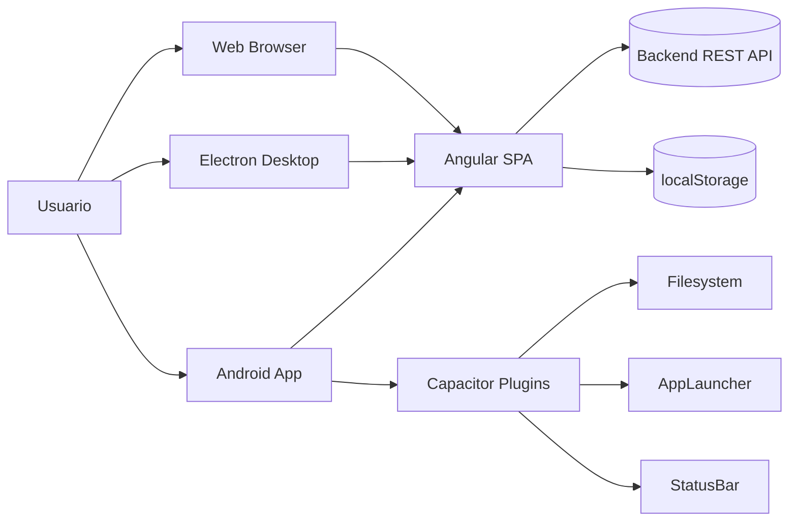
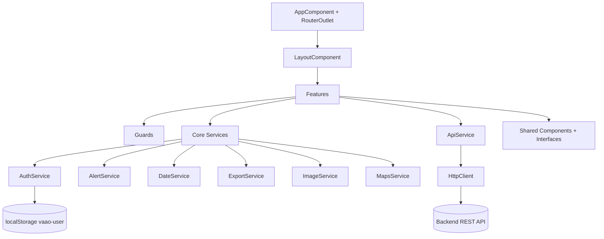
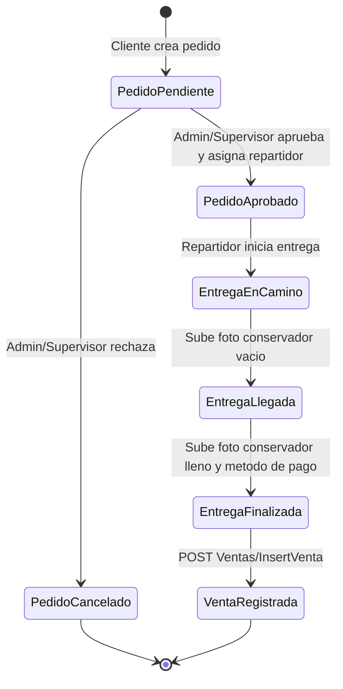
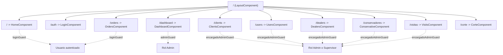

# VAAO

Aplicacion frontend para gestion de venta y distribucion de hielo.  
El proyecto corre como SPA en navegador, como app desktop en Electron y como app Android con Capacitor.

## Objetivo funcional

VAAO cubre el flujo operativo completo:

- Login por rol.
- Alta y administracion de clientes, usuarios y repartidores.
- Registro y aprobacion de pedidos.
- Ejecucion de entregas con evidencia fotografica.
- Registro de ventas y reportes.
- Registro de visitas a clientes.

## Stack tecnico

- Angular 17 (standalone components + Router con `withHashLocation()`).
- PrimeNG + PrimeFlex + PrimeIcons para UI.
- Chart.js para dashboard.
- SweetAlert2 para alertas.
- XLSX + FileSaver para exportacion en web.
- Capacitor (Android, StatusBar, Filesystem, AppLauncher).
- Electron para escritorio.

## Arquitectura

### 1) Arquitectura de despliegue



### 2) Arquitectura interna frontend



### 3) Flujo de negocio pedido -> entrega -> venta



### 4) Mapa de rutas y guards



## Estructura del proyecto

```text
vaao/
  electron/
    main.js                  # shell desktop (carga dist/vaao/browser)
    preload.js
  src/
    app/
      core/
        guards/              # admin, supervisor, login
        services/            # auth, alert, export, image, maps, date
      features/
        admin/               # dashboard, users, add-user, add-client, corte
        orders/              # gestion de pedidos y entregas
        visits/              # registro de visitas con evidencia
        ...
      infrastructure/
        api.service.ts       # wrapper HttpClient + manejo de error
      shared/
        components/
        interfaces/
        const/
    environments/
      environment.ts         # urlBackend activa
      environment.prod.ts    # actualmente vacio
  capacitor.config.ts        # appId, appName, webDir
```

## Roles y permisos

Roles definidos en `RoleConst`:

- `1`: Admin
- `2`: Supervisor (Encargado)
- `3`: Repartidor
- `4`: Cliente

Acceso por ruta:

| Ruta | Guard | Roles |
| --- | --- | --- |
| `/auth` | Sin guard | Todos |
| `/` | `loginGuard` | Admin, Supervisor, Repartidor, Cliente |
| `/dashboard` | `adminGuard` | Admin |
| `/orders` | `loginGuard` | Admin, Supervisor, Repartidor, Cliente |
| `/clients` | `encargadoAdminGuard` | Admin, Supervisor |
| `/users` | `encargadoAdminGuard` | Admin, Supervisor |
| `/dealers` | `encargadoAdminGuard` | Admin, Supervisor |
| `/conservadores` | `encargadoAdminGuard` | Admin, Supervisor |
| `/visitas` | `encargadoAdminGuard` | Admin, Supervisor |
| `/corte` | Sin guard | Todos (estado actual) |

## Modulos funcionales

### Autenticacion

- Pantalla: `features/login`.
- Endpoint: `POST Users/Login/login`.
- Persistencia de sesion: `localStorage` (`vaao-user`) via `AuthService`.
- Redireccion por rol despues de login:
  - Admin -> `/dashboard`
  - Supervisor -> `/`
  - Repartidor -> `/orders`
  - Cliente -> `/orders`

### Home y layout

- `LayoutComponent`:
  - Menu lateral por rol.
  - Topbar con sesion y logout.
  - Fondo animado con `particles.js`.
- `HomeComponent`:
  - Tarjetas de acceso rapido segun rol.

### Pedidos y entregas (`/orders`)

- Alta de pedido (`AddOrderComponent`):
  - `POST Pedidos/InsertPedidos`.
- Consulta filtrada por rango:
  - `GET Pedidos/GetPedidosFiltrados?start=...&end=...`.
- Aprobacion/rechazo (Admin/Supervisor):
  - `PATCH Pedidos/UpdatePedido/{idPedido}`.
- Reparto (Repartidor):
  - Iniciar entrega: `POST Entregas/CreateEntrega`.
  - Evidencia llegada (conservador vacio): `PATCH Entregas/UpdateEntrega/{idEntrega}/false`.
  - Finalizar entrega y registrar venta:
    - `PATCH Entregas/UpdateEntrega/{idEntrega}/true`
    - `POST Ventas/InsertVenta`
- Detalle de evidencia:
  - `GET Entregas?pedidoId={idPedido}`
- Integracion mapas:
  - `MapsService` abre URL de ubicacion (AppLauncher en Android, `window.open` en web).

Estados usados en frontend:

- Pedido:
  - `1` Pendiente
  - `2` Aprobado
  - `3` Cancelado/Rechazado
- Entrega:
  - `1` En camino
  - `2` Llegada
  - `3` Finalizado

### Dashboard (`/dashboard`)

- Indicadores de venta diaria/semanal/mensual:
  - `GET Dashboard/GetDataCards`
- Historico para grafica:
  - `GET Dashboard/GetHistoricoVentas`
- Estatus de pedidos:
  - `GET Dashboard/GetEstatusPedidos`
- Exportables:
  - Ventas perdidas: `GET Report/GetVentasPerdidas`
  - Pedidos rechazados: `GET Report/GetPedidosRechazados`

### Clientes (`/clients`)

- Consulta:
  - `GET Clientes/GetClientes`
- Alta (modal `AddClientComponent`):
  - `POST Users/InsertUsers` (usuario cliente)
  - `POST Clientes/InsertClientes`
- Edicion inline:
  - `PATCH Clientes/UpdateUser/{idCliente}`
- Baja:
  - `DELETE Clientes/DeleteCientes/{id}`

### Usuarios (`/users`)

- Consulta:
  - `GET Users/GetUsers`
- Alta:
  - `POST Users/InsertUsers`

### Repartidores (`/dealers`)

- Consulta:
  - `GET Repartidores/GetRepartidores`
- Alta (modal `AddDealerComponent`):
  - `POST Users/InsertUsers` (rol repartidor)
  - `POST Repartidores/InsertRepartidores`

### Conservadores (`/conservadores`)

- Consulta:
  - `GET Conservador/GetConservadores`
- Export CSV desde tabla PrimeNG.

### Visitas (`/visitas`)

- Consulta por fecha:
  - `GET Visitas/GetVisitas?date=...`
- Registro (modal `AddVisitComponent`):
  - `POST Visitas/InsertVisita`
  - Incluye evidencia en base64.

### Corte (`/corte`)

- Pantalla en estado inicial con datos mock locales.
- No consume API en la implementacion actual.

## Servicios core

- `ApiService`: wrapper de `HttpClient` para `get/post/patch/delete` con `catchError`.
- `AuthService`: sesion reactiva con `BehaviorSubject<User | null>`.
- `AlertService`: mensajes y confirmaciones con SweetAlert2.
- `DateService`: utilidades de rango semanal.
- `ImageService`: redimension y conversion a base64.
- `ExportService`: exporta XLSX (web descarga; Android guarda en Documents).
- `MapsService`: abre mapa segun plataforma.

## Configuracion de entorno

Archivo activo:

- `src/environments/environment.ts`

Valor actual:

- `urlBackend: 'http://localhost:5048/api/'`

Nota:

- `environment.prod.ts` esta vacio.
- `angular.json` no define `fileReplacements`, por lo que build de produccion usa la misma configuracion base salvo que se agregue reemplazo manual.

## Ejecucion local

### Requisitos

- Node.js 18+ recomendado.
- npm.
- Backend VAAO disponible y accesible desde `urlBackend`.

### Instalar dependencias

```bash
npm install
```

### Ejecutar en web (desarrollo)

```bash
npm start
```

Abrir: `http://localhost:4200/`

### Build web

```bash
npm run build
```

Salida: `dist/vaao/browser`

### Ejecutar en Electron

```bash
npm run electron
```

Notas de Electron:

- Carga `dist/vaao/browser/index.html`.
- Ventana fija `390x844`.
- DevTools se abren automaticamente (linea marcada en `electron/main.js`).

### Ejecutar en Android (Capacitor)

```bash
npm run build
npx cap sync android
npx cap open android
```

`capacitor.config.ts`:

- `appId: com.vaao.app`
- `appName: vaao`
- `webDir: dist/vaao/browser`

## Pruebas

```bash
npm run test
```

Framework: Karma + Jasmine.

## Dependencias clave de negocio

- UI: `primeng`, `primeflex`, `primeicons`.
- Graficas: `chart.js`.
- Reportes: `xlsx`, `file-saver`.
- Evidencia y nativo: `@capacitor/*`.
- Alertas: `sweetalert2`.

## Observaciones tecnicas actuales

- La app usa hash routing (`/#/...`) para facilitar despliegue estatico, Electron y WebView.
- `AppComponent` ajusta StatusBar solo en plataforma nativa.
- Varias altas crean usuario automatico con contrasena inicial `1234` (cliente y repartidor).
- La ruta `/corte` no tiene guard y aun esta en modo demo/mock.
